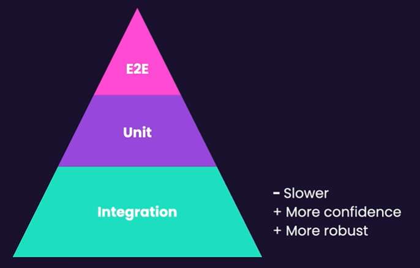

# Testing Components

[React Testing Library](https://testing-library.com/docs/react-testing-library/introduction)

- [¿Qué probar en un componente?](#qué-probar-en-un-componente)
- [Probar rendering](#probar-rendering)
- [Probar interacciones del usuario](#probar-interacciones-del-usuario)
- [Cómo trabajar con componentes de librerías](#cómo-trabajar-con-componentes-de-librías)
- [Técnicas para simplificar los tests](#técnicas-para-simplificar-los-tests)

## ¿Qué probar en un componente?

Probar el <b>comportamiento</b> no la implementación, es decir, hay que abstraerse de los hooks, estados y contextos que utilice el componente y sólo probar el resultado de este (Caja Negra).
No probar los estilos, ya que son frágiles, es decir, que pueden modificarse con el tiempo y suelen ocupar más tiempo del que uno piensa al principio.



## Probar rendering

- [queries](https://testing-library.com/docs/queries/about)

[Prueba de componente Greet](../react-testing-starter/tests/components/Greet.test.tsx)

Se utiliza la función `render` de la librería testing-library para renderizar el componente. Luego, se obtiene con el objeto `screen` el elemento html se carga en el DOM, con esto podemos probar si el elemento contiene la palabra `Hello` junto con el nombre del usuario o si renderiza un botón con un contenido en específico.

[Prueba de componente UserAccount](../react-testing-starter/tests/components/UserAccount.test.tsx)

Se prueban tres casos, uno para comprobar que se renderiza el nombre del usuario, uno para un usuario que no es admin y otro para un usuario que es admin.
En caso de que el usuario no sea admin el `botón edit` no debe aparecer. En caso de ser admin, el botón debe aparecer y tener el contenido `edit`.

[Prueba de componente UserList](../react-testing-starter/tests/components/UserList.test.tsx)

Se prueban dos casos, uno por si el array de `users` es vacío y otro en caso de que contenga datos.
Si el array está vacío se debe mostrar un mensaje que contenga `no users`. En caso contrario, se debe mostrar una lista de enlaces con dirección a los detalles de cada usuario.

[Prueba de componente ProductImageGallery](../react-testing-starter/tests/components/ProductImageGallery.test.tsx)

Se prueban dos casos, uno por si el array de `imageUrls` es vacío y otro en caso de que contenga datos.
Si el array está vacío no debe mostrar nada en pantalla y si contiene datos se debe mostrar una lista de imágenes que contengas el atributo `src` con la url de la imagen correspondiente.

## Probar interacciones del usuario

- [user-event](https://testing-library.com/docs/user-event/intro)

## Cómo trabajar con componentes de librerías

## Técnicas para simplificar los tests

Crear `helper functions` que renderizan componentes con sus props y callbacks `mockeados`, y que retornan aquellos elementos necesarios para las pruebas, ya sea botones, inputs, etc. Además, también puede retornar el setup de un user event para poder interactuar con ellos.

```tsx
const renderComponent = (props) => {
  const onSubmit = vi.fn();

  render(
    <Component
      {...props}
      onSubmit={onSubmit})
    />
  );

  return { onSubmit, user: userEvent.setup(), button: screen.getByRole("button") };
}
```

## Hallar errores de tipos con ESLint

```js
//.eslintrc.cjs
module.exports = {
  root: true,
  env: { browser: true, es2020: true },
  extends: [
    "eslint:recommended",
    "plugin:@typescript-eslint/recommended-type-checked", // Agregar validación de tipos
    "plugin:react-hooks/recommended",
  ],
  ignorePatterns: ["dist", ".eslintrc.cjs"],
  parser: "@typescript-eslint/parser",
  /* Añadir las configuraciones de tsconfig */
  parserOptions: {
    project: true,
    tsconfigRootDir: __dirname,
  },
  plugins: ["react-refresh"],
  rules: {
    "react-refresh/only-export-components": [
      "warn",
      { allowConstantExport: true },
    ],
  },
};
```
